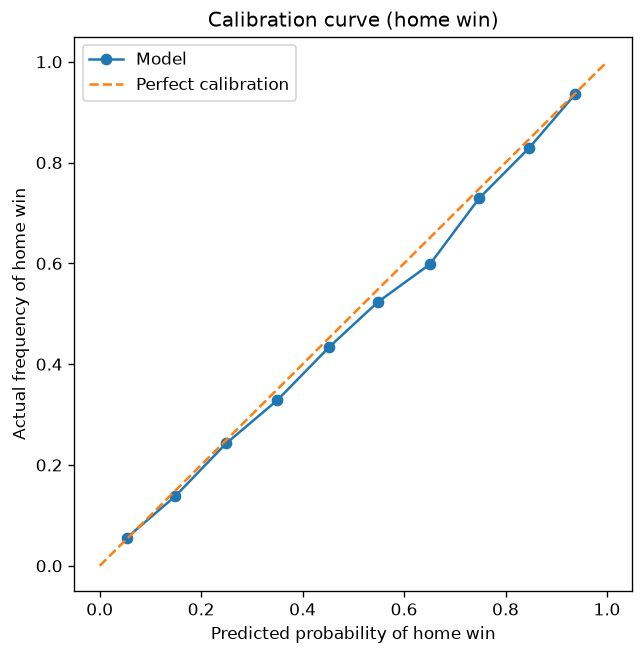

# World Cup Predictor

A probabilistic football tournament forecaster that combines a match-outcome
model with Monte Carlo simulation. It predicts individual matches as
calibrated probabilities, then simulates a knockout bracket thousands of times
to estimate each team's chance of reaching every round — and of winning it all.

## What it does

Given the teams remaining in a tournament's knockout stage, the simulator plays
out the rest of the tournament 10,000 times and reports each team's probability
of advancing through each round and lifting the trophy. Because it works from
any single-elimination stage, you can re-run it as results come in and teams are
eliminated.

Example output — a forecast of the 2026 World Cup from the quarterfinal stage:

```
             Quarterfinal  Semifinal  Final  Champion
Argentina          100.0%      76.7%  53.9%     31.0%
Spain              100.0%      69.2%  40.7%     23.0%
France             100.0%      64.8%  33.5%     17.6%
England            100.0%      72.9%  30.0%     13.4%
Morocco            100.0%      35.2%  12.8%      5.2%
Belgium            100.0%      30.8%  13.0%      5.1%
Switzerland        100.0%      23.3%  10.1%      3.2%
Norway             100.0%      27.1%   6.0%      1.3%
```

## How it works

The project is a pipeline, each stage a separate module that feeds the next:

1. **Data** (`load_data.py`) — loads international match results (1990–present),
   parses dates, and sorts chronologically. Processing matches in strict time
   order is essential to everything downstream.

2. **Elo ratings** (`elo.py`) — assigns every team a dynamic strength rating
   that updates after each match, with the size of the update scaled by how
   surprising the result was. Each match records both teams' ratings *as they
   stood before kickoff*.

3. **Features** (`features.py`) — for each match, engineers each team's recent
   form (points over the last 5 games) and recency-weighted rolling averages of
   goals scored and goals conceded — all computed from prior games only.

4. **Model** (`model.py`) — a logistic regression classifier predicting the
   3-way outcome (home win / draw / away win) as probabilities, from the Elo,
   form, goals, and neutral-venue features.

5. **Simulation** (`simulation.py`) — a Monte Carlo knockout simulator that uses
   the model's match probabilities to play out a bracket thousands of times.

## Results

Evaluated on held-out matches from 2018 onward (the model never saw them during
training):

| Metric | Value | Notes |
|---|---|---|
| Accuracy | 0.599 | vs. ~0.48 for always predicting "home win" |
| Log loss | 0.874 | lower is better |
| Log loss (baseline) | 1.051 | predicting class frequencies only |

The model's log loss of **0.874** clearly beats the **1.051** no-information
baseline, confirming the engineered features carry real predictive signal.

**Calibration** — because the probabilities feed directly into the simulation,
it matters that they mean what they claim. The reliability curve below shows the
predicted home-win probability against the observed frequency; it closely tracks
the diagonal, with mild overconfidence in the mid-to-high range.



## Validation: 2026 World Cup backtest

As a real out-of-sample test, the model was evaluated on all 96 matches of the
2026 World Cup (`backtest.py`). This is a genuine backtest: the model is trained
only on pre-2018 data, so every 2026 match is unseen, and each match's features
were computed from prior games only.

| Metric | Value |
|---|---|
| Matches evaluated | 96 |
| Accuracy | 0.625 |
| Log loss (model) | 0.860 |
| Log loss (baseline) | 1.059 |

The model's performance on this fresh tournament (62.5% accuracy, 0.860 log loss)
is consistent with its held-out test-set results, and again beats the baseline
by a clear margin. Its mistakes are almost all genuine upsets (e.g. Norway
eliminating Brazil) or draws — outcomes a historical-strength model correctly
rates as unlikely — rather than systematic errors.

*Note: knockout matches decided on penalties are recorded as draws (the
regulation result), since shootouts are stored separately; the model is scored
on the regulation outcome.*

## Feature-engineering experiment: recency weighting

The goals features originally used a flat average over each team's last five
games. On the hypothesis that recent games carry more signal, this was replaced
with an exponentially-weighted average (decay factor alpha = 0.7, so the most
recent game counts most and older games fade off). Measured against the
flat-window version on the 2026 backtest:

| Version | Accuracy | Log loss |
|---|---|---|
| Flat 5-game average | 0.615 | 0.862 |
| Recency-weighted (alpha = 0.7) | 0.625 | 0.860 |

Recency weighting produced a small, consistent improvement in both metrics. The
gain is modest — partly because the Elo rating already captures recency — but it
is a real, measured improvement validated on out-of-sample data rather than an
assumption. (On a 96-match sample the effect is small and could vary on other
data.)

## Design decisions

- **Time-based train/test split (no random shuffling).** The data is split by
  date — train before 2018, test 2018+ — rather than randomly. A random split
  would leak future matches into training, letting the model "learn from the
  future" and inflating its scores. A chronological split mirrors real use: the
  model only ever sees the past to predict the future, so the reported metrics
  are honest.

- **Proper scoring over accuracy.** Log loss and calibration judge the quality
  of the *probabilities*, not just whether the top pick was right — which is what
  matters for a simulator that consumes those probabilities directly.

- **Neutral-site symmetrization.** Knockout matches are on neutral ground, so
  each matchup is predicted twice with the teams swapped between the home/away
  slots and averaged, removing any arbitrary home-advantage bias.

- **Draws in knockouts.** A drawn knockout match goes to extra time and
  penalties, modeled as a coin flip: each side receives half of the predicted
  draw probability.

## Running it

Requires the `results.csv` international-results dataset in a `data/` folder.

```bash
pip install -r requirements.txt

# Reproduce the model evaluation and calibration plot:
python model.py

# Backtest the model on the 2026 World Cup:
python backtest.py

# Run the tournament simulation:
python simulation.py
```

The simulation reads the remaining teams from `teams.txt` — one team per line,
in bracket order (line 1 plays line 2, line 3 plays line 4, and the winners
meet). The number of teams must be a power of two (8 = quarterfinals, 4 = semis).
Edit `teams.txt` as teams are eliminated and re-run. If a team name isn't
recognized, `find_team('...')` lists the dataset's exact spellings.

## Limitations & future work

- Team strength reflects each team's most recent form; it does not update
  from results *within* the tournament being simulated.
- The match model is a logistic regression baseline; a gradient-boosted model
  (e.g. HistGradientBoostingClassifier, XGBoost, LightGBM) could capture
  feature interactions and is a natural next step to benchmark against it.
- No live data feed — ratings come from a static dataset. Wiring in a live
  football results API would make the forecaster fully current.
- The simulator handles single-elimination knockouts; a full group-stage
  simulation (round-robin standings and tiebreakers) would extend it to model a
  tournament from the very start.